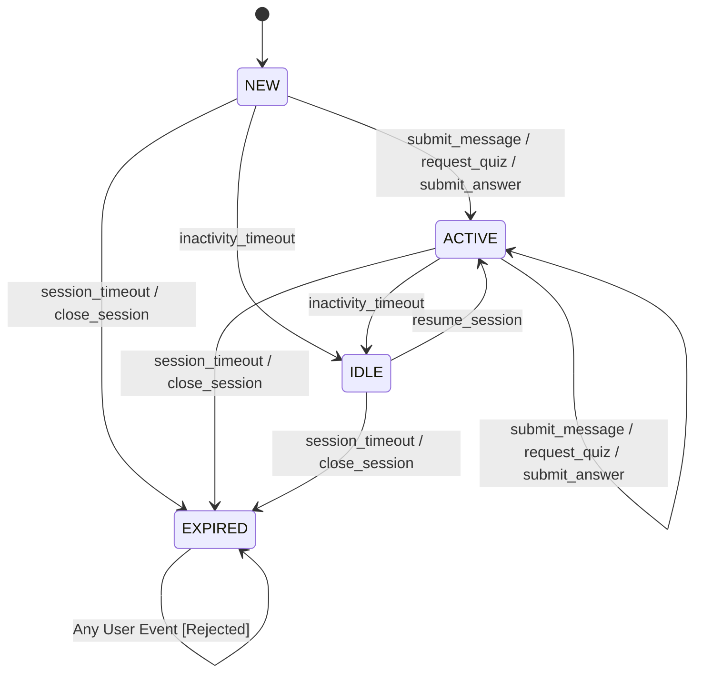

# Test Design

## Ex 7.1 - Step 1 & 2 - Equivalence Class Partitioning and Boundary Value Analysis

### Parameter: `topic`

| Parameter | Class ID | Class Type | Partition Description | Representative Test Value |
|-----------|----------|------------|-----------------------|---------------------------|
| topic | EC-T-1 | Valid | String length between 3 and 100 characters (inclusive) | "Mathematics" (11 characters) |
| topic | EC-T-2 | Invalid | String length less than 3 characters | "A" (1 character) |
| topic | EC-T-3 | Invalid | String length greater than 100 characters | String with 105 "A"s |
| topic | EC-T-4 | Invalid | Null or empty string | `null` or `""` |

#### Justifications
*   **EC-T-1**: The chosen value ("Mathematics", 11 chars) is a valid representative because it falls safely within the accepted length range of 3 to 100 characters, representing nominal behavior for a valid topic request. This class contains boundaries. Derived values for the lower bound are 2 (just outside), 3 (on bound), and 4 (just inside). Derived values for the upper bound are 99 (just inside), 100 (on bound), and 101 (just outside). This maps to the primary acceptance scenario of FR-003.
*   **EC-T-2**: A 1-character string ("A") is chosen because it represents any string shorter than the minimum required length. The boundary values for this partition directly overlap with the lower bounds of the valid class (2 characters being the boundary for this invalid class). This ensures the rejection mechanism for too-short topics works as specified in FR-003.
*   **EC-T-3**: A string of 105 characters is chosen because it cleanly falls into the invalid range of > 100 characters, testing the system's ability to reject overly long inputs. The boundary value is 101 characters (just outside the valid upper bound). This tests the error-handling constraint of FR-003.
*   **EC-T-4**: `null` or `""` is chosen because it evaluates the system's robustness against missing data altogether, checking edge cases where an expected string parameter is absent. This maps to defensive programming/validation rules inherent in FR-003.

### Parameter: `count`

| Parameter | Class ID | Class Type | Partition Description | Representative Test Value |
|-----------|----------|------------|-----------------------|---------------------------|
| count | EC-C-1 | Valid | Integer between 1 and 10 (inclusive) | 5 |
| count | EC-C-2 | Invalid | Integer less than 1 | 0 |
| count | EC-C-3 | Invalid | Integer greater than 10 | 15 |

#### Justifications
*   **EC-C-1**: The value 5 is chosen because it is an average nominal case inside the valid 1-10 range representing a typical quiz request size. This class contains boundary values. Derived values for the lower bound are 0 (outside), 1 (bound), and 2 (inside). Derived values for the upper bound are 9 (inside), 10 (bound), and 11 (outside). This maps to FR-003.
*   **EC-C-2**: The value 0 represents an invalid request for no questions or a negative number of questions, testing the lower constraint. Its boundary value is 0 (the first invalid value below the valid lower bound of 1). This maps to the rejection handling of FR-003.
*   **EC-C-3**: The value 15 represents any integer larger than the maximum allowed, verifying the system imposes its upper limit. Its boundary value is 11 (the first invalid value above the valid upper bound of 10). This tests the upper constraint of FR-003.

### Parameter: `difficulty`

| Parameter | Class ID | Class Type | Partition Description | Representative Test Value |
|-----------|----------|------------|-----------------------|---------------------------|
| difficulty| EC-D-1 | Valid | Exact match constraint: "easy", "medium", or "hard" | "medium" |
| difficulty| EC-D-2 | Invalid| Any other string value | "expert" |
| difficulty| EC-D-3 | Invalid| Null, blank, or empty string | `""` (Empty string) |

#### Justifications
*   **EC-D-1**: Choosing "medium" serves as a valid substitute since only "easy", "medium", or "hard" exist in this specific enumerated set, representing typical positive usage. As this is an enumeration/set rather than a continuous range, boundary values are not applicable here. This maps to the primary acceptance scenario of FR-003.
*   **EC-D-2**: The string "expert" represents a seemingly valid word that falls outside the explicitly permitted set, testing the exact-match constraint. No boundary values apply. Tests the rejection constraint of FR-003.
*   **EC-D-3**: An empty string (`""`) or `null` tests the system's resilience to missing required enum/choice data. No boundary values apply. Tests the strict rejection constraint of FR-003.

---

## Ex 7.1 - Step 3 - Decision Table for Answer Evaluation

**Conditions:**
*   **C1:** Answer correctness
*   **C2:** Answer is empty or blank
*   **C3:** Quiz item still exists in session

**Actions:**
*   **A1:** Return "Item not found" error feedback
*   **A2:** Return validation error indicating the answer cannot be empty
*   **A3:** Return positive feedback indicating correct answer
*   **A4:** Return constructive feedback indicating partially correct answer
*   **A5:** Return corrective feedback indicating incorrect answer

| Rules | 1 | 2 | 3 | 4 | 5 |
| :--- | :--- | :--- | :--- | :--- | :--- |
| **Conditions** | | | | | |
| C3: Quiz item exists in session? | No | Yes | Yes | Yes | Yes |
| C2: Answer is empty or blank? | - | Yes | No | No | No |
| C1: Answer correctness | - | - | Correct | Partially correct | Incorrect |
| **Actions** | | | | | |
| A1: Return "Item not found" error | X | | | | |
| A2: Return empty answer error | | X | | | |
| A3: Return "Correct" feedback | | | X | | |
| A4: Return "Partial" feedback | | | | X | |
| A5: Return "Incorrect" feedback | | | | | X |

### Requirements Mapping per Rule:
*   **Rule 1**: Maps to exceptional/edge case handling where user attempts to answer a stale, deleted, or unassigned quiz item id.
*   **Rule 2**: Maps to an input validation step before evaluation (Answer cannot be empty edge case).
*   **Rule 3**: Maps to **FR-004** successful evaluation outcome (Fully Correct scenario).
*   **Rule 4**: Maps to **FR-004** partial evaluation outcome (Partially Correct scenario).
*   **Rule 5**: Maps to **FR-004** failure evaluation outcome (Incorrect scenario).

## Ex 7.2 - Step 1 - State Transition Diagram

## Ex 7.2 - Step 2 - State Transition Table

| Current State | Event | Next State | Output / Action |
| :--- | :--- | :--- | :--- |
| **NEW** | `submit_message` | **ACTIVE** | Message accepted; session context updated |
| **NEW** | `request_quiz` | **ACTIVE** | Quiz generated; session context updated |
| **NEW** | `submit_answer` | **ACTIVE** | Answer processed; session context updated |
| **NEW** | `inactivity_timeout` | **IDLE** | Session marked as idle; context retained |
| **NEW** | `session_timeout` | **EXPIRED** | Session expired; data marked for cleanup |
| **NEW** | `close_session` | **EXPIRED** | Session terminally closed |
| **NEW** | `resume_session` | - (invalid) | Return controlled error: session already active/new |
| **ACTIVE** | `submit_message` | **ACTIVE** | Message accepted; timer reset |
| **ACTIVE** | `request_quiz` | **ACTIVE** | Quiz generated; timer reset |
| **ACTIVE** | `submit_answer` | **ACTIVE** | Answer processed; timer reset |
| **ACTIVE** | `inactivity_timeout` | **IDLE** | Session marked as idle; context retained |
| **ACTIVE** | `session_timeout` | **EXPIRED** | Session expired; data marked for cleanup |
| **ACTIVE** | `close_session` | **EXPIRED** | Session terminally closed |
| **ACTIVE** | `resume_session` | - (invalid) | Return controlled error: session already active |
| **IDLE** | `submit_message` | - (invalid)* | Return controlled error: must resume active state first |
| **IDLE** | `request_quiz` | - (invalid)* | Return controlled error: must resume active state first |
| **IDLE** | `submit_answer` | - (invalid)* | Return controlled error: must resume active state first |
| **IDLE** | `inactivity_timeout` | **IDLE** | Ignored / Timeout updated |
| **IDLE** | `session_timeout` | **EXPIRED** | Session expired; data marked for cleanup |
| **IDLE** | `close_session` | **EXPIRED** | Session terminally closed |
| **IDLE** | `resume_session` | **ACTIVE** | Session re-activated; timers reset |
| **EXPIRED** | `submit_message` | - (invalid) | Return controlled error: session expired |
| **EXPIRED** | `request_quiz` | - (invalid) | Return controlled error: session expired |
| **EXPIRED** | `submit_answer` | - (invalid) | Return controlled error: session expired |
| **EXPIRED** | `inactivity_timeout` | - (invalid) | Ignored / Not applicable |
| **EXPIRED** | `session_timeout` | - (invalid) | Ignored / Not applicable |
| **EXPIRED** | `close_session` | - (invalid) | Ignored / Not applicable |
| **EXPIRED** | `resume_session` | - (invalid) | Return controlled error: session expired |

## Ex 7.2 - Step 3 - Test Case Derivation (All-Transitions Coverage)

### Sequence 1: Main Happy Path & Idling
*   **Requirement:** FR-005 (Session retention and persistence), FR-001 (Chat)
*   **Start State:** `NEW`
*   **Events & Expected Results:**
    1.  `submit_message` ➔ State: `ACTIVE`, Output: Message accepted.
    2.  `request_quiz` ➔ State: `ACTIVE`, Output: Quiz generated.
    3.  `submit_answer` ➔ State: `ACTIVE`, Output: Answer evaluated.
    4.  `inactivity_timeout` ➔ State: `IDLE`, Output: Session idled.
    5.  `resume_session` ➔ State: `ACTIVE`, Output: Session resumed.
    6.  `close_session` ➔ State: `EXPIRED`, Output: Session explicitly closed.

### Sequence 2: Early Timeout
*   **Requirement:** FR-005 (Session timeouts)
*   **Start State:** `NEW`
*   **Events & Expected Results:**
    1.  `session_timeout` ➔ State: `EXPIRED`, Output: Session expired abruptly.

### Sequence 3: Early Close
*   **Requirement:** FR-005
*   **Start State:** `NEW`
*   **Events & Expected Results:**
    1.  `close_session` ➔ State: `EXPIRED`, Output: Session closed without activity.

### Sequence 4: Idle Initialization and Idle Timeout
*   **Requirement:** FR-005 (Idle state handling)
*   **Start State:** `NEW`
*   **Events & Expected Results:**
    1.  `inactivity_timeout` ➔ State: `IDLE`, Output: Session conditionally idled.
    2.  `session_timeout` ➔ State: `EXPIRED`, Output: Idled session hit max lifetime limits.

### Sequence 5: Active session timeout
*   **Requirement:** FR-005 (Max active lifespan)
*   **Start State:** `NEW`
*   **Events & Expected Results:**
    1.  `request_quiz` ➔ State: `ACTIVE`, Output: Quiz generated.
    2.  `session_timeout` ➔ State: `EXPIRED`, Output: Session expired.

### Sequence 6: Initial Submit Answer and Idle Close
*   **Requirement:** FR-005 (Unusual sequence of valid actions)
*   **Start State:** `NEW`
*   **Events & Expected Results:**
    1.  `submit_answer` ➔ State: `ACTIVE`, Output: Answer evaluated or rejected (but state is valid).
    2.  `inactivity_timeout` ➔ State: `IDLE`, Output: Session marked as idle.
    3.  `close_session` ➔ State: `EXPIRED`, Output: Idling user explicitly closed session.

### Sequence 7: Invalid Transition Testing (Expired interaction)
*   **Requirement:** FR-009, NFR-003, Edge-case "session state missing or expired"
*   **Start State:** `NEW`
*   **Events & Expected Results:**
    1.  `close_session` ➔ State: `EXPIRED`, Output: Session terminally closed.
    2.  `submit_message` ➔ State: `EXPIRED` (No state change), Output: Return controlled error "session expired".
    3.  `resume_session` ➔ State: `EXPIRED` (No state change), Output: Return controlled error "session expired".

## Exercise 7.3 - Reflection: Test Design Technique Comparison

### Complementarity
Different testing techniques excel at uncovering different classes of defects:
*   **ECP and BVA** are best suited for validating scalar inputs, constraints, and singular parameter validations. *ESBot Example:* Validating that a student cannot request an absurd amount of questions in a `QuizRequest` by strictly enforcing boundaries on the `count` and `topic` parameters.
*   **Decision Tables** excel at modeling combinations of independent boolean or discrete logical conditions where business rules dictate specific outcomes. *ESBot Example:* The answer evaluation logic (FR-004), where the feedback depends on whether the item exists, whether the input is empty, and the semantic correctness of the answer.
*   **State Transition Testing** is ideal for systems involving lifecycles, sequential workflows, and time-dependent context. *ESBot Example:* Managing the `UserSession` (FR-005), ensuring that once a session reaches the `EXPIRED` state, late-arriving messages or quiz answers are correctly rejected rather than processed out of context.

### Gaps
Traditional black-box techniques like ECP, Decision Tables, and State Modeling struggle to effectively test **non-deterministic outputs**, such as the actual natural language generation produced by the LLM (e.g., chat messages in FR-001 or quiz question generation in FR-003). Because these techniques rely on strict expected outputs, they fail when a "correct" system can produce hundreds of slightly different valid responses.
*   **Alternative Technique:** *Metamorphic Testing* or *Exploratory AI Testing* would be highly beneficial here. Instead of checking for an exact string, Metamorphic testing checks relations-for example, if a student asks the exact same question but with poor grammar, the core educational fact returned by the bot should remain the same. 

### Effort vs. Value
For the ESBot project, the **Decision Table technique** likely produced the highest defect-detection value relative to the design effort based on requirement **FR-004** (Answer Evaluation). Drawing up the table requires minimal effort but immediately forces the tester to consider combinations that developers frequently miss-such as what the system should do if an answer is mathematically "Correct" but the session considers the quiz item "Non-existent/Stale". Because the core educational value of ESBot relies entirely on providing accurate, non-confusing feedback to the student, ensuring all evaluation edge cases are explicitly handled prevents critical pedagogical failures. State transition testing also provides immense value for FR-005, but mapping every possible invalid transition across all states requires a significantly higher upfront documentation effort.

_Note:_ For this task we used Gemini 3.1 Pro (with GitHub Copilot) in order to improve our writing (grammar, words etc.).