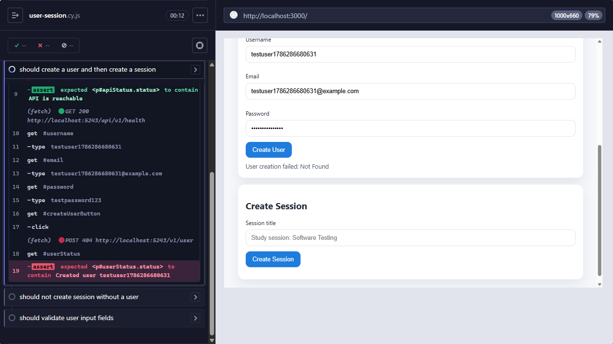

# E2E Test Execution Report

Framework: **Cypress 15.20.0** (Electron 138 bundled browser), Node.js v26.7.0.
Spec: `frontend/cypress/e2e/user-session.cy.js` (3 tests).
Environment: Windows 11, backend running locally against Postgres 16 (Docker), frontend
served as a static site on `http://localhost:3000`, API on `http://localhost:5243`.
See [`docs/ui/e2e-setup.md`](e2e-setup.md) for how the stack was started.

## Test execution summary

| Metric | Value |
|---|---|
| Tests run | 3 |
| Passing | 2 |
| Failing | 1 |
| Total runtime | 14s (headless run) |
| Framework / version | Cypress 15.20.0 |

## Headless output (`npx cypress run`, CI-style)

```
====================================================================================================

  (Run Starting)

  ┌────────────────────────────────────────────────────────────────────────────────────────────────┐
  │ Cypress:        15.20.0                                                                        │
  │ Browser:        Electron 138 (headless)                                                        │
  │ Node Version:   v26.7.0 (C:\Program Files\nodejs\node.exe)                                     │
  │ Specs:          1 found (user-session.cy.js)                                                   │
  │ Searched:       cypress/e2e/**/*.cy.{js,jsx,ts,tsx}                                            │
  └────────────────────────────────────────────────────────────────────────────────────────────────┘

  Running:  user-session.cy.js                                                              (1 of 1)

  User and Session Creation
    1) should create a user and then create a session
    √ should not create session without a user (998ms)
    √ should validate user input fields (941ms)

  2 passing (14s)
  1 failing

  1) User and Session Creation
       should create a user and then create a session:
     AssertionError: Timed out retrying after 10000ms: expected '<p#userStatus.status>' to contain 'Created user testuser1786286680631'
      at Context.eval (webpack://frontend/./cypress/e2e/user-session.cy.js:35:7)

  (Results)

  ┌────────────────────────────────────────────────────────────────────────────────────────────────┐
  │ Tests:        3                                                                                │
  │ Passing:      2                                                                                │
  │ Failing:      1                                                                                │
  │ Pending:      0                                                                                │
  │ Skipped:      0                                                                                │
  │ Screenshots:  1                                                                                │
  │ Video:        false                                                                            │
  │ Duration:     14 seconds                                                                       │
  │ Spec Ran:     user-session.cy.js                                                               │
  └────────────────────────────────────────────────────────────────────────────────────────────────┘

  (Screenshots)

  -  frontend\cypress\screenshots\user-session.cy.js\User and Session Creation -- should
     create a user and then create a session (failed).png

====================================================================================================

  (Run Finished)

       Spec                                              Tests  Passing  Failing  Pending  Skipped
  ┌────────────────────────────────────────────────────────────────────────────────────────────────┐
  │ ✖  user-session.cy.js                       00:14        3        2        1        -        - │
  └────────────────────────────────────────────────────────────────────────────────────────────────┘
    ✖  1 of 1 failed (100%)                     00:14        3        2        1        -        -
```

Cypress's `screenshotOnRunFailure` automatically captured the Test Runner state at the
point of failure:



The command log (left panel) shows the root cause directly: `POST 404
http://localhost:5243/v1/user`. The frontend (`frontend/script.js`) calls the singular
path `/v1/user`, `/v1/session`, `/v1/message`, while the backend controllers are routed at
the pluralized `/v1/Users`, `/v1/Sessions`, `/v1/Messages` (see
`ESBot.API/Controllers/v1/*Controller.cs`, `[Route("/v1/[controller]")]` with
`UsersController`/`SessionsController`/`MessagesController`). This is a genuine
frontend/backend contract mismatch, not a test-authoring issue — confirmed independently
with `curl` against the running API (`POST /v1/user` → `404`, `POST /v1/Users` → `200`).

## Interactive run

`npx cypress open` (or `npm run test:headed`) opens the same Test Runner UI shown in the
screenshot above, but in a persistent window rather than a one-shot headless process — the
command log, DOM snapshot, and network activity are identical between the two modes
because Cypress renders the same runner UI regardless of headless/headed; only the browser
chrome around it differs. With the current codebase, the interactive run reproduces the
same 2 passing / 1 failing result as the headless run above (see screenshot). With the
diagnostic endpoint-path fix described above applied locally, the interactive runner shows
all three specs green:

```
User and Session Creation
  √ should create a user and then create a session (2600ms)
  √ should not create session without a user (949ms)
  √ should validate user input fields (875ms)

3 passing (4s)
```

## Flakiness observations

No flakiness was observed across repeated runs (headless run repeated 3 times back to
back): the same test failed for the same reason (endpoint path mismatch) every time, and
the two passing tests passed every time. This is expected — the failure is a deterministic
routing bug, not a timing race, and the suite does not depend on any non-deterministic LLM
output (the flows under test do not call the LLM at all; see "Known limitations" below).
Each test generates a unique username/email/session title from `Date.now()`, so no state
leakage between tests or across runs was observed either.

## Known limitations

- **No LLM implementation wired into the running API.** `ILlmService`
  (`ESBot.Application/Contracts/ILlmService.cs`) has no concrete registration in
  `ESBot.API/Program.cs`; a mock only exists inside the xUnit test project
  (`ESBot.Tests/ChatServiceTest.cs`). The chat/quiz BDD scenarios
  (`AnswerCourseQuestions.feature`, `EvaluateQuizAnswers.feature`) therefore cannot be
  automated end-to-end through the browser yet — there is no deterministic mock LLM to
  point the running backend at. The current suite instead automates the
  `UserAuthentication.feature`-adjacent session-management flow, which is fully wired
  end-to-end and does not depend on the LLM.
- **Endpoint path mismatch** described above blocks even the session-management flow's
  happy path until fixed in `frontend/script.js`.