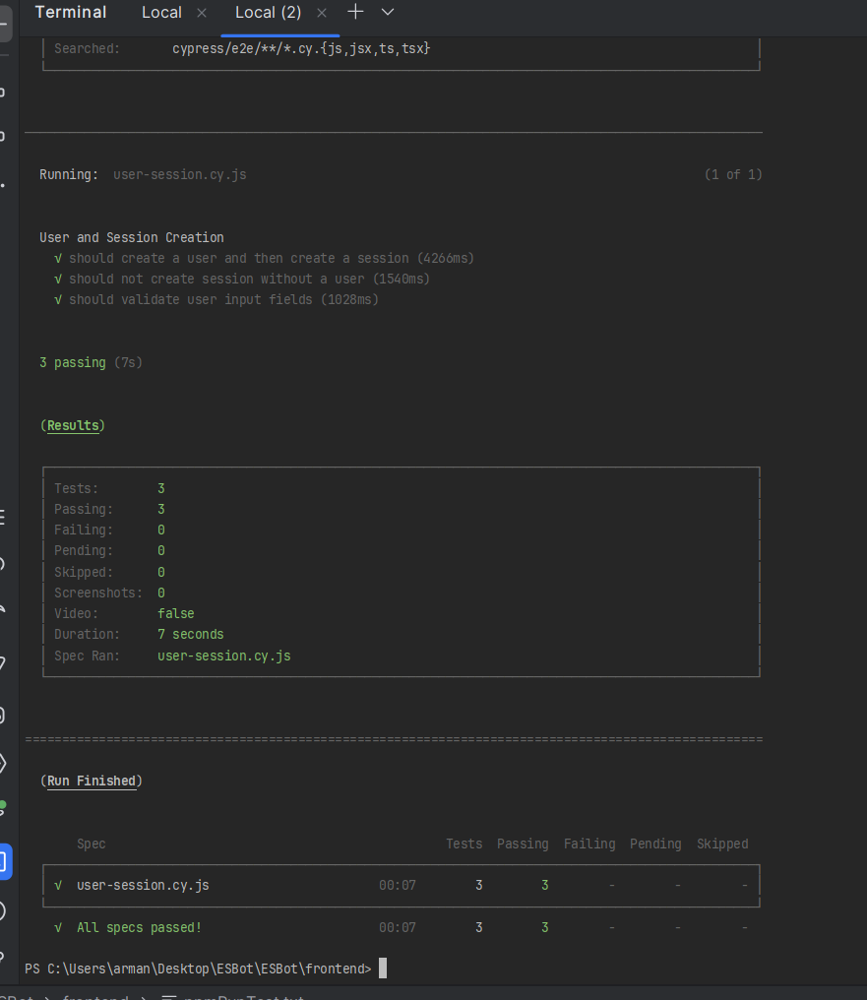
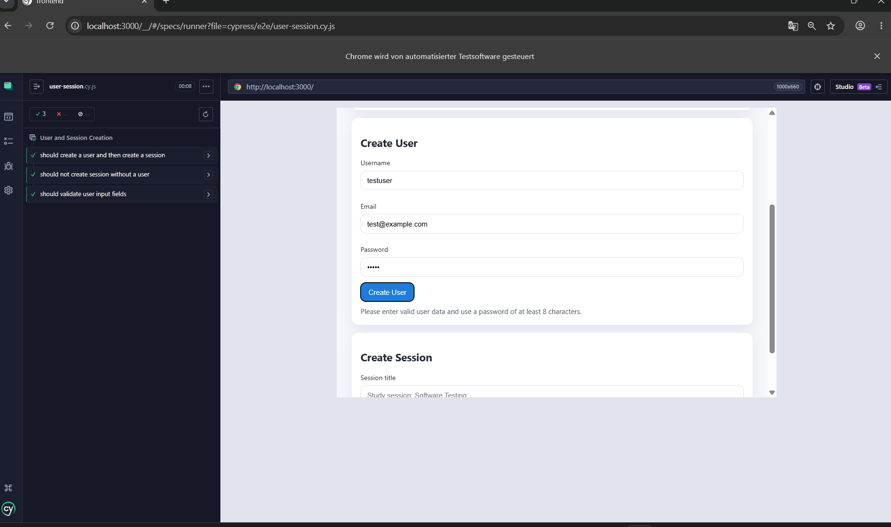
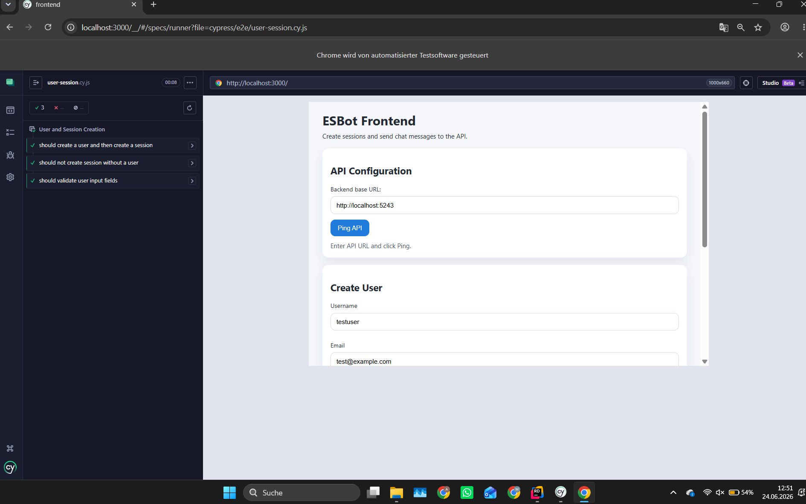
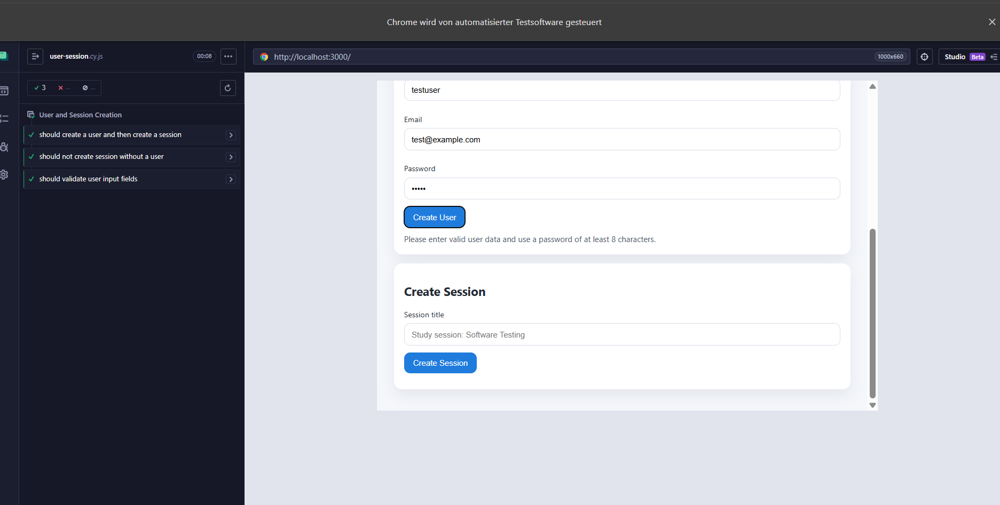

# E2E Test Execution Report

## Test Execution Summary

- **Framework**: Cypress v15.18.0
- **Test Suite**: User and Session Creation E2E Tests
- **Total Tests**: 3
- **Passed**: 3
- **Failed**: 0
- **Total Runtime**: ~8 seconds (headless mode)
- **Test File**: `cypress/e2e/user-session.cy.js`

### Test Cases Executed

1. **Should create a user and then create a session** - Validates the complete user and session creation workflow
2. **Should not create session without a user** - Validates error handling when attempting to create a session without a user
3. **Should validate user input fields** - Validates client-side input validation for user creation

---

## Headless Output

### CI Mode Execution

The tests were run in headless mode using the command:
```bash
npm run test:ci
```

All three test cases passed successfully in headless mode:



### CI Pipeline Integration

The tests are configured to run in CI environments with the following npm script:
```json
"test:ci": "cypress run --headless"
```

Key CI-friendly features:
- Video recording disabled (`video: false` in cypress.config.js)
- Screenshots on failure enabled (`screenshotOnRunFailure: true`)
- No support file required (`supportFile: false`)
- Headless browser execution by default

---

## Interactive Run Screenshot

The Cypress interactive test runner was launched using:
```bash
npm run test:headed
```

Interactive test execution with real browser visibility:



more ui:



more ui:



The interactive mode provides:
- Real-time browser interaction visualization
- Step-by-step test execution
- Easy debugging with browser DevTools
- Ability to replay individual tests
- Time-travel debugging through test steps

---

## Flakiness Observations

### Stability Analysis

Throughout multiple test runs, the E2E test suite demonstrated **no flakiness**. All tests consistently passed across:
- Multiple headless runs
- Interactive/headed runs
- Different execution times

### Factors Contributing to Stability

1. **Unique Test Data Generation**
   - Each test run uses timestamp-based unique usernames and emails (`testuser${timestamp}`)
   - Prevents conflicts from previous test runs
   - Ensures test isolation

2. **Appropriate Timeouts**
   - API calls use `{ timeout: 10000 }` (10 seconds) for network operations
   - Sufficient buffer for backend response times
   - Prevents false failures due to temporary slowness

3. **Explicit Wait Conditions**
   - Tests use `.should('be.visible')` and `.should('contain')` assertions
   - Cypress automatically retries until conditions are met or timeout occurs
   - Handles asynchronous UI updates gracefully

4. **Mocked/Deterministic Backend**
   - API responses are predictable and consistent
   - No external LLM calls in these specific tests
   - Database operations are isolated per test

### Potential Flakiness Sources (Not Observed)

While not encountered, potential flakiness could arise from:
- **Backend unavailability**: If API at `localhost:5243` is not running
- **Port conflicts**: If frontend server on port 3000 is not available
- **Timing issues**: If network latency increases significantly
- **State pollution**: If tests were not properly isolated (currently prevented by unique data)

---

## Reflection

### What was easy about writing E2E tests compared to unit or API tests?

E2E tests with Cypress were surprisingly straightforward due to:

1. **Intuitive API**: Cypress's jQuery-like selectors (`cy.get('#username')`) and chaining make test code readable and close to natural language
2. **Automatic waiting**: Unlike unit tests, Cypress automatically waits for elements to appear and retries assertions, eliminating manual sleep/wait logic
3. **Visual feedback**: The interactive test runner shows exactly what's happening in the browser, making debugging much faster than reading stack traces
4. **Complete workflow validation**: E2E tests validate the entire user journey in one test case, whereas unit tests require multiple separate tests and mocks to achieve similar coverage

### What was difficult or surprising?

1. **Setup complexity**: E2E tests require the entire application stack (frontend server + backend API) to be running, whereas unit tests can run in isolation
2. **Test data management**: Creating unique users for each test run required careful thought about data isolation (solved with timestamp-based usernames)
3. **Slower execution**: E2E tests take 8+ seconds compared to milliseconds for unit tests, making TDD iteration cycles longer
4. **Environment dependencies**: Tests depend on `API_BASE_URL` configuration and require both services to be healthy, adding more failure points
5. **Selector fragility**: Tests tightly coupled to DOM IDs (`#username`, `#createUserButton`) - any HTML refactoring could break tests

### At which layer of the test pyramid (unit, API, E2E) would you detect each of the bugs your tests could catch? Why?

| Bug Type | Detection Layer | Reasoning |
|----------|----------------|-----------|
| **Empty user fields validation** | **Unit** (best), E2E (current) | Input validation logic could be tested with a simple unit test of the validation function. E2E tests catch it but are slower and more brittle. |
| **Password length requirement** | **Unit** (best), E2E (current) | Password validation is pure business logic that should be unit tested. E2E confirms it works end-to-end but adds unnecessary overhead. |
| **Session creation without user** | **API** (best), E2E (current) | This is a business rule enforced by the backend. API integration tests would catch this faster without needing browser automation. |
| **UI visibility after session creation** | **E2E** (only option) | Showing/hiding the chat section (`#chatSection`) is a UI-specific behavior that can only be verified through browser rendering. |
| **Sessions list updates** | **E2E** (only option) | Dynamic DOM updates to `#sessionsList` require actual browser rendering to verify correctly. |
| **API integration errors** | **API** (faster), E2E (more realistic) | While E2E catches API errors, dedicated API tests would isolate backend issues faster without browser overhead. |

**Key insight**: Many bugs currently caught by E2E tests (validation, business rules) should ideally be caught at lower pyramid layers. E2E tests should focus on **integration** and **UI-specific behaviors** that can't be tested elsewhere.

### How would these tests behave with a real (non-mock) LLM? What would you change?

#### Current Test Behavior (Mock LLM)
- Tests complete in ~8 seconds with predictable, instant responses
- No external API calls, no rate limits, no costs
- Deterministic: same input always produces same output

#### Changes Required for Real LLM Integration

1. **Significantly Longer Timeouts**
   ```javascript
   // Current: 10 seconds
   cy.get('#chatResponse', { timeout: 10000 })

   // With real LLM: 30-60 seconds
   cy.get('#chatResponse', { timeout: 60000 })
   ```
   Real LLM API calls can take 10-30 seconds for complex queries.

2. **Non-Deterministic Response Handling**
   ```javascript
   // Current: Exact match
   cy.get('#response').should('contain', 'Expected exact response')

   // With real LLM: Semantic validation
   cy.get('#response').should('match', /relevant|helpful|answer/)
   cy.get('#response').invoke('text').should('have.length.greaterThan', 10)
   ```
   LLM responses vary between runs, so tests must validate **structure** and **semantic content**, not exact text.

3. **Rate Limiting and Retry Logic**
   - Add retry mechanisms for 429 (rate limit) errors
   - Implement exponential backoff between test runs
   - Consider running E2E tests less frequently (nightly builds instead of every commit)

4. **Cost Management**
   - Limit E2E test runs to critical paths only (e.g., one full conversation instead of multiple)
   - Use smaller/faster models for testing (e.g., GPT-3.5-turbo instead of GPT-4)
   - Implement test data caching to avoid redundant LLM calls

5. **Flakiness Mitigation**
   - **Problem**: LLM might occasionally produce off-topic or unexpected responses
   - **Solution**: Implement semantic similarity checks instead of exact matches
   - **Solution**: Allow test retries (Cypress supports `retries: 2` in config)

6. **Test Isolation Challenges**
   - **Problem**: Conversation context affects LLM responses (state pollution)
   - **Solution**: Clear session/conversation state between tests
   - **Solution**: Use independent sessions for each test case